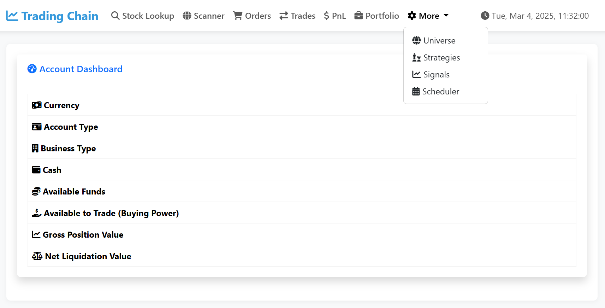

# Trading System



## Overview

Trading System is a comprehensive web application that integrates with Interactive Brokers (IBKR) to provide automated trading capabilities. The system combines a responsive web interface with powerful backend functionality for market analysis, trade execution, and portfolio management.

## Key Features

### 1. IBKR Gateway Integration

- Connects to the Interactive Brokers Gateway to access the IBKR Web API
- Maintains authenticated sessions for seamless trading operations
- Provides real-time account data and market information

### 2. Responsive Web Application

- Modern, intuitive user interface for desktop and mobile devices
- Real-time account dashboard showing portfolio value, available funds, and positions
- Comprehensive navigation system for all trading functions

### 3. IBKR Client Implementation

- Complete implementation of IBKR Web API endpoints
- Handles authentication, market data requests, order placement, and account information
- Robust error handling and retry mechanisms for reliable operation

### 4. Advanced Scheduler System

- Comprehensive job scheduling for automated tasks
- Health monitoring and execution tracking for all scheduled jobs
- Configurable intervals for various system operations

### 5. Market Analysis Tools

- Symbol lookup functionality to find tradable instruments
- Comprehensive market scanners to identify trading opportunities
- Technical analysis indicators for informed decision making

### 6. Symbol Information and Backtesting

- Detailed information pages for individual symbols
- Historical price data visualization
- Backtesting capabilities to evaluate trading strategies on historical data

### 7. Automated Trading Strategy

- Fully automated systematic trading implementation
- Moving average crossover strategy with configurable parameters
- Position sizing based on account value and risk parameters
- Signal detection and trade execution without manual intervention

### 8. Trading Universe Management

- Define and manage a universe of tradable symbols
- Toggle between Simulation and Live Trading modes
- Test strategies in simulation before deploying with real capital

### 9. Portfolio and PnL Tracking

- Real-time portfolio value monitoring
- Detailed profit and loss tracking
- Email notifications for significant PnL changes and trading signals
- Historical performance analysis

## System Architecture

The system consists of two main components:

1. **IBKR Gateway (ibgw)** - Docker container running the Interactive Brokers Gateway
2. **Web Application (webapp)** - The trading system web application

## IBKR Gateway Setup

The IBKR Gateway is containerized using Docker for easy deployment and management. The gateway exposes the IBKR Web API that our trading application will connect to.

### Directory Structure

```
ibgw/
├── conf.yaml         # Configuration for the IBKR Gateway
├── docker-compose.yaml  # Docker Compose configuration
├── Dockerfile        # Docker build instructions
└── start.sh          # Gateway startup script
```

### Configuration

The conf.yaml file contains the configuration for the IBKR Gateway, including:

- API endpoint settings
- SSL configuration
- IP access controls
- Server options

### Starting the IBKR Gateway

1. **Build and start the containers**:
    
    ```
    cd ibgw
    docker-compose up -d
    ```
    
2. **Access the Firefox container** to complete IBKR authentication:
    - Open your browser and navigate to `http://localhost:3000`
    - This opens a Firefox instance running in the container
    - Use this to navigate to the IBKR Gateway interface at `http://localhost:5055`
    - Log in with your IBKR credentials
3. **Verify the Gateway is running**:
    - Check container logs: `docker logs ibgw`
    - Confirm the API is accessible at `http://localhost:5055`

### Environment Variables

The IBKR Gateway container uses the following environment variables:

- `IBKR_ACCOUNT_ID`: Your Interactive Brokers account ID

### Network Configuration

The Docker Compose file is configured to use the host network mode, making the gateway accessible on port 5055 of your host machine. Alternatively, you can uncomment and configure the VPN network settings if you're using a VPN container like gluetun.

### Persistent Storage

The configuration uses Docker volumes for:

- `logs`: Stores IBKR Gateway logs
- `firefox`: Persists Firefox settings and session data

## Web Application Setup

The web application is the main interface for the trading system, providing access to all trading functionality, portfolio management, and strategy configuration.

### Directory Structure

```
webapp/
├── docker-compose.yml  # Docker Compose configuration for webapp and database
├── Dockerfile          # Docker build instructions for the webapp
├── start.sh            # Startup script for the Flask application
└── webapp              # Code base for the Flask application
    ├── blueprints      # Python code according to blueprint design pattern
    └── templates       # HTML templates to render the web pages
```

### Configuration

Before starting the web application, you need to configure the environment variables:

1. **Create an environment file**: Create a `.env` file in the webapp directory with the following variables:
    
    ```
    # Database Configuration
    POSTGRES_USER=your_postgres_user
    POSTGRES_PASSWORD=your_postgres_password
    POSTGRES_DB=trading_db
    PGUSER=your_postgres_user
    
    # PgAdmin Configuration
    PGADMIN_DEFAULT_EMAIL=your_email@example.com
    PGADMIN_DEFAULT_PASSWORD=your_pgadmin_password
    
    # IBKR Gateway Configuration
    IBKR_GATEWAY_URL=http://localhost:5055
    IBKR_ACCOUNT_ID=your_ibkr_account_id
    
    # Application Configuration
    SECRET_KEY=your_secret_key
    DEBUG=False
    FLASK_ENV=production
    
    # Email Notification Configuration (optional)
    SMTP_SERVER=smtp.example.com
    SMTP_PORT=587
    SMTP_USERNAME=your_email@example.com
    SMTP_PASSWORD=your_email_password
    NOTIFICATION_EMAIL=recipient@example.com
    ```
    

### Starting the Web Application

1. **Build and start the containers**:
    
    ```
    cd webapp
    docker-compose up -d
    ```
    
2. **Verify the services are running**:You should see three containers running:
    
    ```
    docker ps
    ```
    
    - `webapp`: The Flask web application (port 5056)
    - `postgres`: PostgreSQL database (port 5432)
    - `pgadmin`: PgAdmin web interface for database management (port 5433)
3. **Access the web application**:
    - Open your browser and navigate to `http://localhost:5056`
    - Log in with your credentials (default admin/admin if not changed)
4. **Access the database management interface**:
    - Open your browser and navigate to `http://localhost:5433`
    - Log in with the email and password specified in your `.env` file
    - Connect to the PostgreSQL server using the credentials from your `.env` file

### Health Monitoring

The web application includes a health endpoint that can be used to monitor the status of the application:

- `http://localhost:5056/health`

The Docker Compose configuration includes a health check that periodically checks this endpoint to ensure the application is running properly.

### Persistent Storage

The configuration uses Docker volumes for:

- `logs`: Stores web application logs
- `postgres_storage`: Persists database data
- `pgadmin_storage`: Persists PgAdmin settings

## Complete System Startup

To start the complete trading system:

1. Start the IBKR Gateway:
    
    ```
    cd ibgw
    docker-compose up -d
    ```
    
2. Authenticate with IBKR through the Firefox container
3. Start the Web Application:
    
    ```
    cd webapp
    docker-compose up -d
    ```
    
4. Access the web application at `http://localhost:5056`

## Technical Implementation

The system is built using a Flask backend with SQLAlchemy ORM for database operations. It implements a comprehensive scheduler using APScheduler for running automated tasks. The frontend uses Bootstrap for responsive design and Chart.js for data visualization.The application is designed with modularity in mind, separating concerns into different components:

- Authentication management
- Database operations
- Scheduling system
- Trading strategy implementation
- Email notifications
- Market data processing

## Troubleshooting

### IBKR Gateway Issues

- If the gateway is not responding, check the container logs: `docker logs ibgw`
- Ensure your IBKR credentials are correct and the session is active
- Verify the gateway is accessible at `http://localhost:5055`

### Web Application Issues

- Check the application logs: `docker logs webapp`
- Verify the database connection by accessing PgAdmin
- Ensure the IBKR Gateway URL is correctly configured in the `.env` file

### Database Issues

- Check the database logs: `docker logs postgres`
- Use PgAdmin to verify the database structure and data
- Ensure the database credentials are correctly configured in the `.env` file

## Disclaimer

This system is based on the great work from Part Time Larry.

https://github.com/hackingthemarkets/interactive-brokers-web-api
